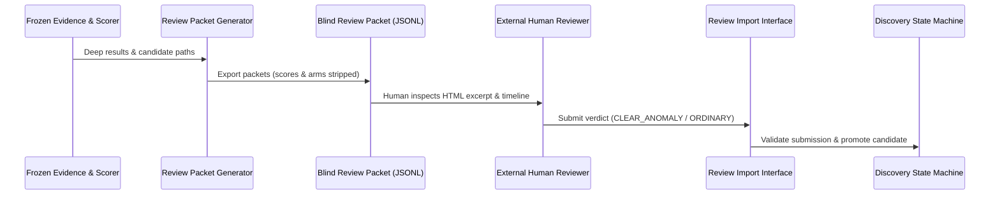

# Project Atlas — Independent Human Review Protocol (Phase 1.9.1)

## 1. Decoupled Review Workflow



---

## 2. Blinding Guarantees
- **Scores**: Model scores and rule point breakdowns are strictly omitted.
- **Arms**: Treatment vs Control arm labels (`COHORT_ALPHA`, `COHORT_BETA`, `TREATMENT`, `CONTROL`) are omitted.
- **Density**: Baseline density ranks and values ($d_{\text{raw}}$) are omitted.
- **Expected Verdicts**: Zero expected answers are included.

---

## 3. Human Submission Schema
Reviewers submit decisions using the JSON format:
```json
{
  "submission_id": "SUB_P191_001",
  "packet_id": "PACKET_P19_001",
  "candidate_id": "CAND_P19_001",
  "reviewer_id": "REVIEWER_EXTERNAL_01",
  "review_timestamp_utc": "2026-08-18T12:00:00Z",
  "verdict": "CLEAR_ANOMALY",
  "evidence_quality": "HIGH",
  "historical_significance": "AUTHENTIC_UNMODERNIZED_RELIC",
  "confidence": "HIGH",
  "reviewer_notes": "Preserves unmodernized HTML layout and table navigation.",
  "is_genuine_human": true
}
```
Imported via: `atlas review import <submissions.jsonl>`.
