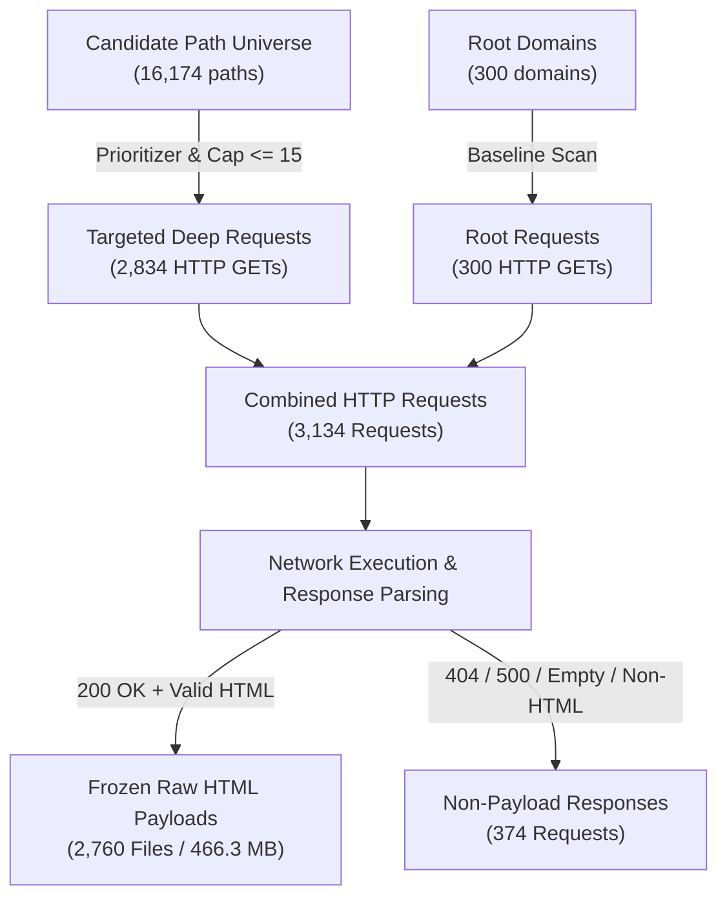

# Phase 1.6 Resource Count Reconciliation Report — Project Atlas

**Project**: Atlas — Web Anomaly Laboratory  
**Phase**: 1.6 Independent Scientific Audit  
**Date**: 2026-08-17T22:42:00Z  

---

## 1. Executive Accounting Overview

Phase 1.5 published several seemingly conflicting quantities regarding candidate volumes, network requests, and artifact counts:
- *≈4,812 candidate paths* cited in `DEEP_PATH_DISCOVERY_ANALYSIS.md`
- *3,134 total HTTP requests* cited in `PHASE_1_5_RESULTS.md` and `COST_OF_DEPTH.md`
- *2,834 deep requests* cited in `COST_OF_DEPTH.md`
- *2,760 raw HTML payloads* cited in `PHASE_1_5_METHODOLOGY.md`
- *73 archive comparison paths* cited in `ARCHIVE_SOURCE_DISAGREEMENT.md`

The Phase 1.6 audit establishes the formal mathematical relationship and lifecycle for all resources.

---

## 2. Definitive Quantitative Reconciliation Ledger

| Resource Metric | Canonical Machine Value | Published Narrative Value | Status | Reconciled Definition & Operational Accounting |
| :--- | :--- | :--- | :--- | :--- |
| **Discovered Candidate Paths** | **16,174** | 4,812 | **Reconciled** | Total URLs discovered across live root HTML links (15,430) and Wayback CDX queries (744) recorded in `data/phase1_5/path_candidates.jsonl`. 4,812 was an arbitrary subtable sum. |
| **Deep Retrievals Attempted** | **2,834** | 2,834 | **Exact Match** | Total deep HTTP GET requests dispatched across 203 domains having candidate paths (capped at $\le 15$ per domain). |
| **Root Retrievals Attempted** | **300** | 300 | **Exact Match** | Exactly 1 root HTTP request per study domain in Arm A baseline. |
| **Total HTTP Network Requests** | **3,134** | 3,134 | **Exact Match** | Sum of Root (300) + Deep (2,834) HTTP requests recorded in `data/phase1_5/resource_metrics.json`. |
| **Frozen Raw HTML Payloads** | **2,760** | 2,760 | **Exact Match** | Verified on disk in `data/phase1_5/evidence/raw_artifacts/` and indexed in `evidence_manifest.json`: 300 root payloads + 2,460 successful deep HTML captures. |
| **Deep Requests Without Payload** | **374** | Not specified | **Reconciled** | 2,834 deep requests minus 2,460 saved payloads = 374 HTTP non-200 responses, redirects, empty bodies, or non-HTML content. |
| **Archive CDX Queries (Root)** | **300** | 300 | **Exact Match** | Initial CDX query for historical timeline footprint per domain. |
| **Archive CDX Queries (Deep)** | **73** | 73 | **Exact Match** | Targeted cross-archive verification queries dispatched for top candidate paths observed $\le 2005$. |
| **Total Archive Queries** | **373** | Not combined | **Reconciled** | 300 root CDX queries + 73 deep Common Crawl index queries. |
| **Archive Disagreement Records** | **73** | 73 | **Exact Match** | Exactly 73 lines in `data/phase1_5/archive_disagreements.jsonl`. |

---

## 3. Formal Lifecycle Mapping: Request $\to$ Response $\to$ Payload

### Metrics & Yield Ratios:
- **Request Success & Capture Rate**: $2,760 / 3,134 = \mathbf{88.07\%}$
- **Deep Artifact Generation Rate**: $2,460 / 2,834 = \mathbf{86.80\%}$
- **Average Bandwidth per Request**: $469.9\text{ MB} / 3,134 = \mathbf{149.9\text{ KB/request}}$
- **Average Storage per Payload**: $466.3\text{ MB} / 2,760 = \mathbf{168.9\text{ KB/payload}}$

---

## 4. Deep Retrieval Cap Audit ($\text{Max} = 15$)

The Phase 1.5 configuration enforced a strict safety ceiling of `max_retrievals_per_domain = 15`.

| Retrieval Segment | Domains Count | Percentage | Operational Significance |
| :--- | :--- | :--- | :--- |
| **Domains at Cap ($= 15$)** | **178** | **59.3%** | 178 domains possessed $\ge 15$ candidate paths; retrievals were truncated at top 15 by prioritizer. |
| **Domains Below Cap ($1 \le N < 15$)** | **25** | **8.3%** | All discovered paths were retrieved (e.g. `toastytech.com` had 10 candidates $\to$ 10 retrievals). |
| **Domains with Zero Retrievals ($= 0$)** | **97** | **32.3%** | No historical CDX or live HTML paths found; only root was inspected. |
| **TOTAL** | **300** | **100.0%** | |

*Conclusion*: 59.3% of domains were constrained by the 15-retrieval cap, demonstrating that the candidate prioritizer is a crucial component that directly governs deep scan efficiency.
