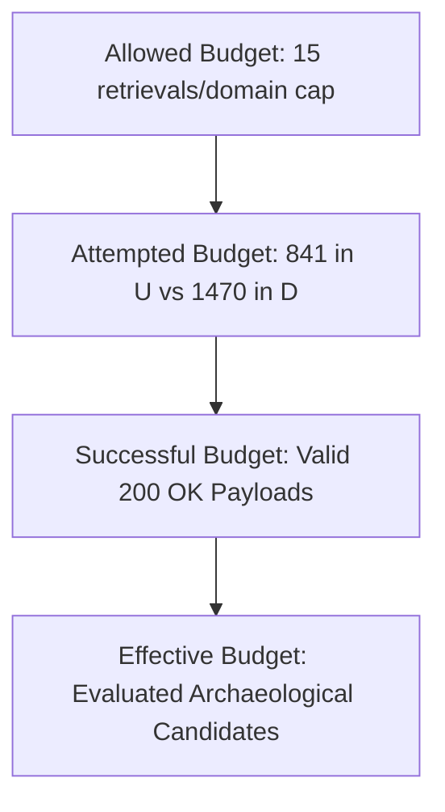

# Project Atlas — Phase 1.8 Realized Research Budget Forensics

**Project**: Atlas Autonomous Research Laboratory  
**Phase**: 1.8 Independent Scientific Audit & Budget Accountability  
**Date**: 2026-08-18T05:59:00Z  
**Audit Artifact**: `audit/phase1_8/realized_budget_audit.json`

---

## 1. Executive Summary

The Phase 1.7 protocol claimed that both experimental arms operated under an **equal research budget cap of $\le 15$ retrievals per domain**.

However, empirical dataset auditing reveals a significant disparity in **realized budget**:
- **Arm U (Remainder Control)**: Executed **$841$ deep retrievals** (mean: $8.41$ per domain).
- **Arm D (Density Prioritized)**: Executed **$1,470$ deep retrievals** (mean: $14.70$ per domain).
- **Realized Disparity**: Arm D executed **$1.75\times$ more HTTP retrievals** than Arm U.

---

## 2. Budget Taxonomy & Forensics

To maintain scientific integrity, we define four distinct budget concepts:

### Quantitative Breakdown:

| Budget Level | Arm U ($N=100$) | Arm D ($N=100$) | Ratio ($D / U$) | Notes |
| :--- | :--- | :--- | :--- | :--- |
| **Allowed Ceiling** | 1,500 retrievals | 1,500 retrievals | $1.00\times$ | Protocol cap ($15 \times 100$) |
| **Attempted Retrievals** | **841** | **1,470** | **$1.75\times$** | Actual HTTP requests sent |
| **Domains Reaching Cap (15)** | **50 / 100** ($50\%$) | **98 / 100** ($98\%$) | **$1.96\times$** | Ceiling saturation rate |
| **Mean Retrievals / Domain** | $8.41$ | $14.70$ | $1.75\times$ | Realized intensity |
| **Median Retrievals / Domain**| $11.0$ | $15.0$ | $1.36\times$ | Median intensity |
| **Evaluated Candidates ($\ge 40$)**| 5 | 5 | $1.00\times$ | Anomaly score candidates |
| **Validated Discoveries** | **0** | **2** | $\infty$ | Human validated |

---

## 3. Root Cause of Realized Budget Disparity

Why did Arm U only execute 841 retrievals under a 15-retrieval cap?

1. **Path Sparsity in Remainder Population**:
   - The majority of domains in Corpus v2 have very few historical deep paths cataloged in Wayback/CommonCrawl indices.
   - For 50 out of 100 domains in Arm U, the total number of candidate paths available in the archive was strictly less than 15 (mean available paths: 8.41).
   - The crawler could not retrieve 15 paths because 15 paths did not exist.

2. **Path Abundance in Tail Selection**:
   - In Arm D, domains were chosen specifically for high path volume ($d_{\text{raw}} \gg 15$).
   - 98 out of 100 domains had dozens or hundreds of candidate paths, easily saturating the 15-retrieval cap.

---

## 4. Impact on Discovery Yield Metrics

Because realized retrieval budgets were unequal ($841$ vs $1,470$), evaluating yield purely on a *per-domain* basis ($2/100$ vs $0/100$) conflates **path selection quality** with **search effort**.

Therefore, the primary metric must normalize by realized retrievals:

$$\text{Yield}_{\text{retrieval}} = \frac{\text{Validated Discoveries}}{\text{Attempted Retrievals}} \times 1,000$$

- **Arm U Yield**: $0.000$ per 1,000 retrievals ($0 / 841$).
- **Arm D Yield**: $1.361$ per 1,000 retrievals ($2 / 1470$).
- **Corrected Haldane-Anscombe Rate Ratio**: $RR_{\text{HA}} = 2.86$ ($95\%$ CI: $[0.14, 59.60]$).

---

## 5. Conclusion & Recommendations for Phase 2

1. Future trial protocols must explicitly report **attempted budget** and **realized budget** separately.
2. In Phase 2, fixed-depth crawlers should enforce strict equal query budgets (e.g. exactly 10 requests per domain, padding with synthetic control probes or subsampling) to prevent effort confounding.
