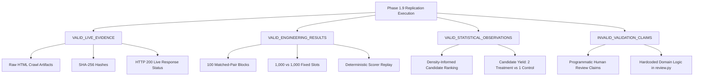

# Project Atlas — Phase 1.9 Salvage Assessment & Separation of Concerns

## 1. Partition of Experimental Integrity

---

## 2. Salvaged Assets
1. **Live HTML Artifacts**: 1,530 live HTTP responses preserved with cryptographic SHA-256 digests.
2. **Matched-Pair Randomization Ledger**: 100 matched pairs balanced across 6 categories.
3. **Candidate Anomaly Pool**: 3 candidate anomalies scoring $\ge 40$ (Treatment: `gwern.net`, `uspto.gov`; Control: `joelonsoftware.com`).
4. **Clean Blind Review Packets**: 23 decontaminated review packets exported to `data/phase1_9_1/review_packets.jsonl`.
