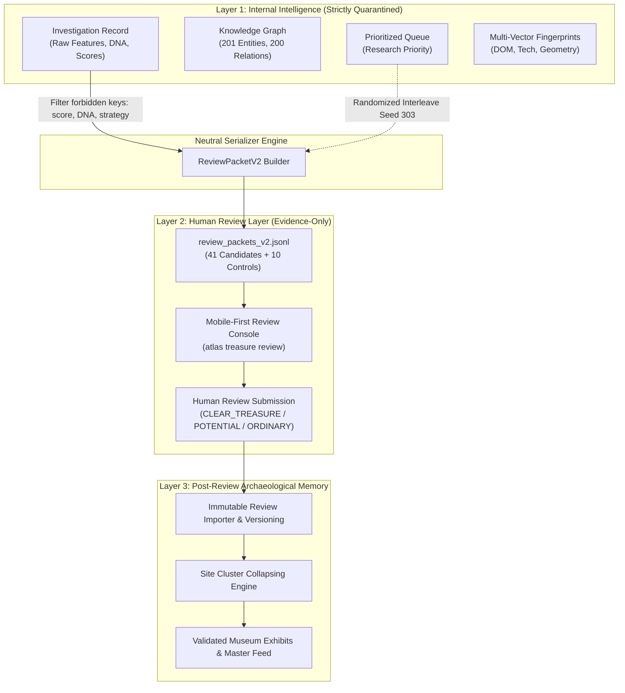

# Project Atlas — Treasure Review Architecture
## Three-Layer Archaeological Data Model & Review Isolation System

```
=====================================================================================
                           PROJECT ATLAS REVIEW ARCHITECTURE
=====================================================================================
```

### 1. Architectural Foundations & Three-Layer Data Separation

To guarantee scientific rigor, prevent confirmation bias, and prohibit synthetic machine validation, Project Atlas enforces a strict 3-layer boundary between observation, review, and retrospective analysis:



---

### 2. Layer Specifications

#### Layer 1: Internal Evidence & Autonomous Diagnostics
- **Access**: Internal discovery engine and offline research pipelines only.
- **Contents**: Full anomaly scores, research priorities, 11-dimensional Treasure DNA vectors, multi-strategy detection histories, cluster IDs, and machine explanations.
- **Policy**: Must never be directly accessed or imported by the human review UI.

#### Layer 2: Human Review Packet V2
- **Access**: Human reviewers and review console interface (`atlas treasure review`).
- **Contents**: Strict neutral facts only — observed URLs, HTTP response headers, content types, collection timestamps, raw HTML references, screenshot paths, archive capture timestamps, SHA-256 evidence digests, and objective navigation scope (links inspected count).
- **Prohibited Tokens**: `score`, `priority`, `rank`, `strategy`, `DNA`, `cluster`, `orphan_status`, `machine_explanation`, `expected_verdict`, `retro_styling`, `ancient_page`.

#### Layer 3: Post-Review Archaeological Memory
- **Access**: Museum curator, release gates, and post-hoc research analytics.
- **Contents**: Frozen human review verdicts combined with underlying evidence. Triggers exhibit promotion only upon verified `CLEAR_TREASURE` human consensus.

---

### 3. Verification & Isolation Summary

- **Filesystem Isolation**: Review console code resides in [`atlas/review/console.py`](file:///workspaces/web-anomaly/atlas/review/console.py) with access restricted to [`data/treasure_runs/TREASURE_RUN_0003/review_v2/`](file:///workspaces/web-anomaly/data/treasure_runs/TREASURE_RUN_0003/review_v2/).
- **Review Immutability**: All submissions are appended to `review_events.jsonl` with revision tracking (`review_version`, `supersedes_review_id`).
- **Anti-Bot Defense**: Rejects machine/bot reviewer IDs at runtime.
